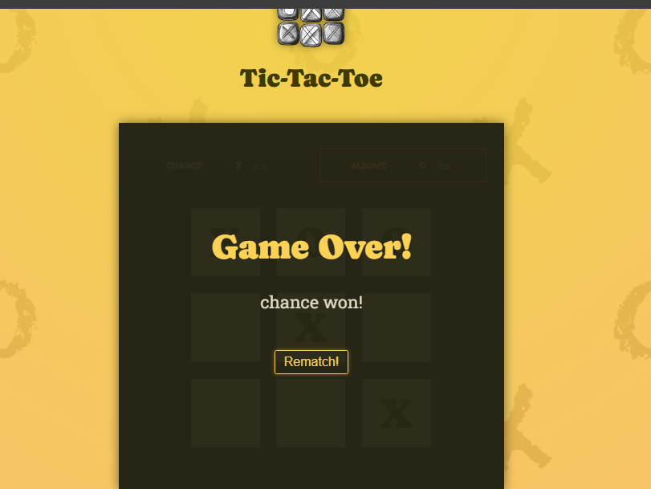

# Tic-Tac-Toe 
### Two Player Game Built with React and Vite.

**Built as practice project from course "React - The complete Guide 2024 (incl. Next.js, Redux)**

### Game Play:
---




---
### To Run:
1. open terminal in root directory

2. Copy the following command and run it in your terminal:
```sh
npm install
```
3. Copy the following command and run it in your terminal:
```sh
npm run dev
```

4. then open http link in browser and play the game!